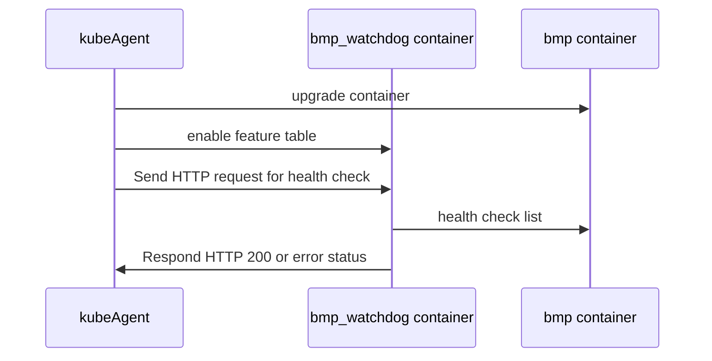

```mermaid
sequenceDiagram
    participant kubeAgent
    participant bmp_watchdog container
    participant bmp container
    kubeAgent->>bmp container: upgrade container
    kubeAgent->>bmp_watchdog container: enable feature table
    kubeAgent->>bmp_watchdog container: Send HTTP request for health check
    bmp_watchdog container->>bmp container: health check list
    bmp_watchdog container->>kubeAgent: Respond HTTP 200 or error status
```