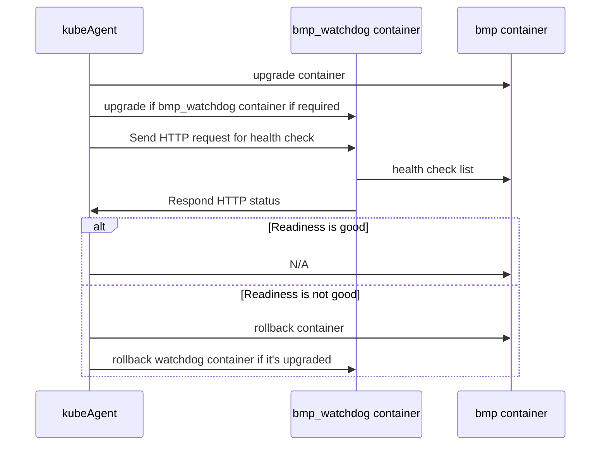

```mermaid
sequenceDiagram
    participant kubeAgent
    participant bmp_watchdog container
    participant bmp container
    kubeAgent->>bmp container: upgrade container
    kubeAgent->>bmp_watchdog container: upgrade if bmp_watchdog container if required
    kubeAgent->>bmp_watchdog container: Send HTTP request for health check
    bmp_watchdog container->>bmp container: health check list
    bmp_watchdog container->>kubeAgent: Respond HTTP status
    alt Readiness is good
        kubeAgent->>bmp container: N/A
    else Readiness is not good
        kubeAgent->>bmp container: rollback container
        kubeAgent->>bmp_watchdog container: rollback watchdog container if it's upgraded
    end
```