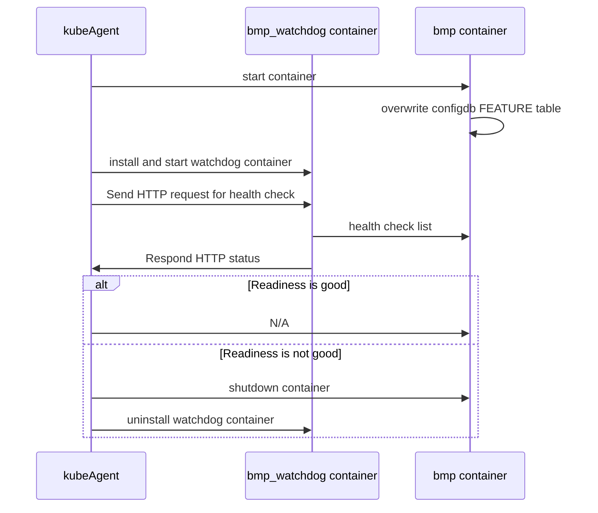

```mermaid
sequenceDiagram
    participant kubeAgent
    participant bmp_watchdog container
    participant bmp container
    kubeAgent->>bmp container: start container
    bmp container->>bmp container: overwrite configdb FEATURE table
    kubeAgent->>bmp_watchdog container: install and start watchdog container
    kubeAgent->>bmp_watchdog container: Send HTTP request for health check
    bmp_watchdog container->>bmp container: health check list
    bmp_watchdog container->>kubeAgent: Respond HTTP status
    alt Readiness is good
        kubeAgent->>bmp container: N/A
    else Readiness is not good
        kubeAgent->>bmp container: shutdown container
        kubeAgent->>bmp_watchdog container: uninstall watchdog container

    end
```