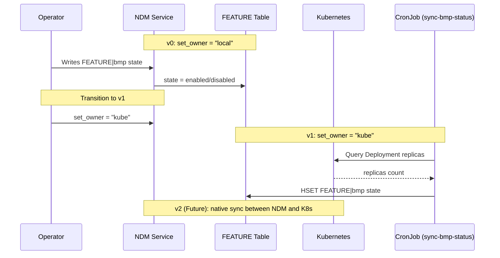

```mermaid
sequenceDiagram
    participant Operator
    participant NDM as NDM Service
    participant GoldenConfig as FEATURE Table
    participant K8s as Kubernetes
    participant Cron as CronJob (sync-bmp-status)

    %% v0: NDM owns FEATURE
    Note over NDM, GoldenConfig: v0: set_owner = "local"
    Operator->>NDM: Writes FEATURE|bmp state
    NDM->>GoldenConfig: state = enabled/disabled

    %% v1: Kube owns FEATURE
    Note over Operator, NDM: Transition to v1
    Operator->>NDM: set_owner = "kube"

    Note over Cron, GoldenConfig: v1: set_owner = "kube"
    Cron->>K8s: Query Deployment replicas
    K8s-->>Cron: replicas count
    Cron->>GoldenConfig: HSET FEATURE|bmp state

    %% v2: Future
    Note over NDM, K8s: v2 (Future): native sync between NDM and K8s
```