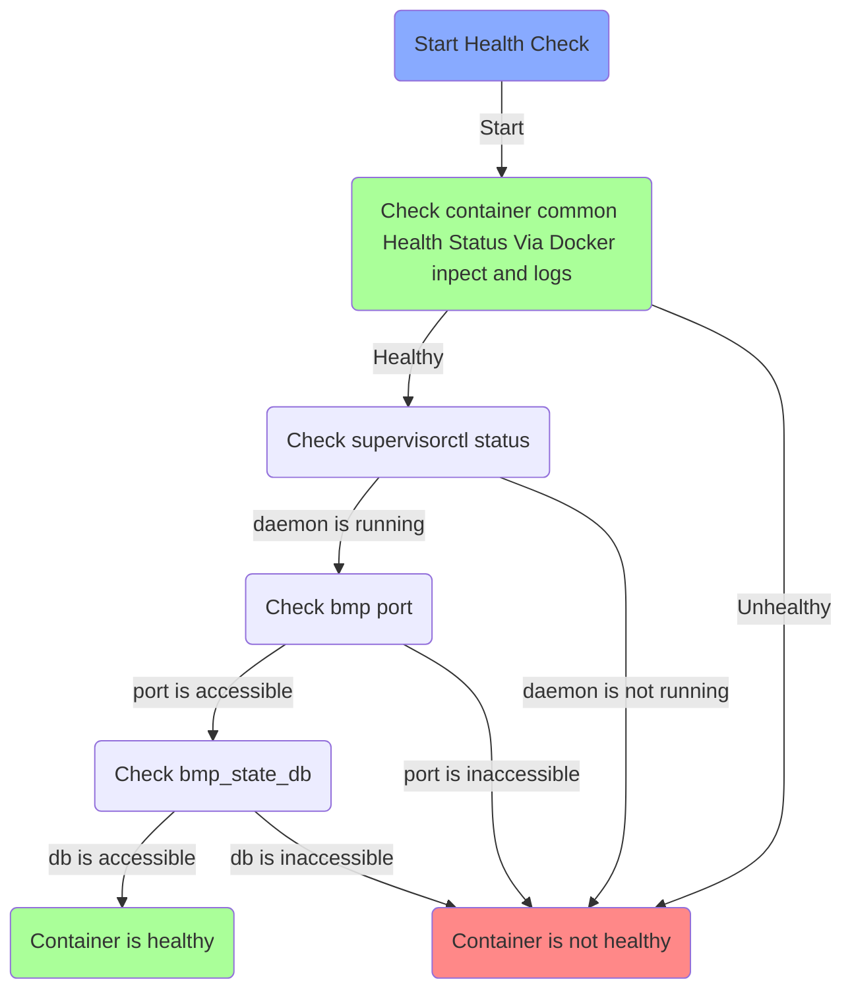

```mermaid
flowchart
    id_start(Start Health Check)
    style id_start fill:#8AF
    id_docker(Check container common Health Status Via Docker inpect and logs)
    style id_docker fill:#AF9
    id_supervisorctl(Check supervisorctl status)
    id_bmp_port(Check bmp port)
    id_bmp_db(Check bmp_state_db)
    id_healthy(Container is healthy)
    style id_healthy fill:#AF9
    id_unhealthy(Container is not healthy)
    style id_unhealthy fill:#F88

    id_start-->|Start|id_docker
    id_docker-->|Healthy|id_supervisorctl
    id_docker-->|Unhealthy|id_unhealthy
    id_supervisorctl-->|daemon is running|id_bmp_port
    id_supervisorctl-->|daemon is not running|id_unhealthy
    id_bmp_port-->|port is accessible|id_bmp_db
    id_bmp_port-->|port is inaccessible|id_unhealthy
    id_bmp_db-->|db is accessible|id_healthy
    id_bmp_db-->|db is inaccessible|id_unhealthy
```
