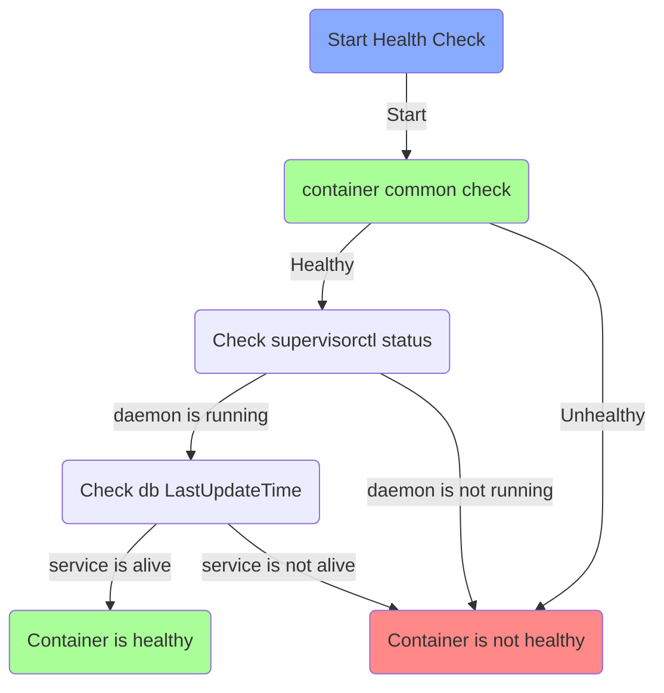

```mermaid
flowchart
    id_start(Start Health Check)
    style id_start fill:#8AF
    id_docker("container common check")  
    style id_docker fill:#AF9
    id_supervisorctl(Check supervisorctl status)
    id_state_db(Check db LastUpdateTime)
    id_healthy(Container is healthy)
    style id_healthy fill:#AF9
    id_unhealthy(Container is not healthy)
    style id_unhealthy fill:#F88

    id_start-->|Start|id_docker
    id_docker-->|Healthy|id_supervisorctl
    id_docker-->|Unhealthy|id_unhealthy
    id_supervisorctl-->|daemon is running|id_state_db
    id_supervisorctl-->|daemon is not running|id_unhealthy
    id_state_db-->|service is alive|id_healthy
    id_state_db-->|service is not alive|id_unhealthy

```
